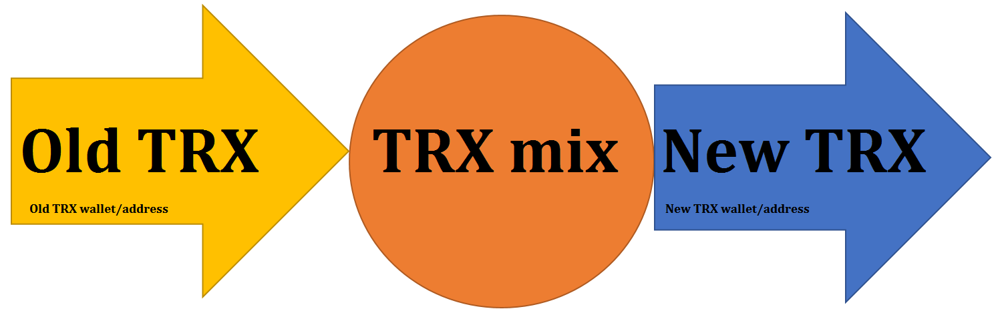

# ArcadiaTron
_____________
ArcadiaTron is a token that helps deal with privacy when doing transactions within the Tron Network as well as being used for ecommerce, fundraisers, payments, and tipping.

Tron is not anonymous. All transactions are kept in a public ledger and your IP address can even be tied to Tron. If you want to hide your spending habits and how much Tron you control, it is recommended to always mix or blend your Tron with a TRX blender/mixer.  Currently anyone can be tracked when doing transactions in the Tron Network.  For privacy and security reasons, people need to have an option to evade hackers and thieves that have infiltrated someone's online account or wallet with the purpose of tracking and stealing their Tron coins.  
  * Arcadiatron is working on building a blender/mixing service utilizing TOR and other private security features.
  * The ArcadiaTron token will allow a user to pay for this serive when using the ArcadiaTron service.
  * ArcadiaTron tokens can be used to pay for blender/mixer services, payments, betting, online games, fundraisers, tipping and a myriad of other uses.

